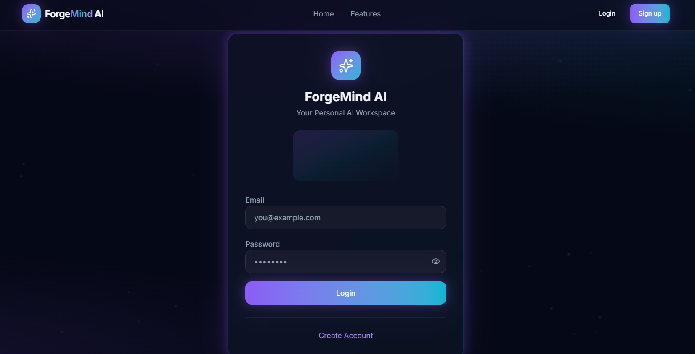
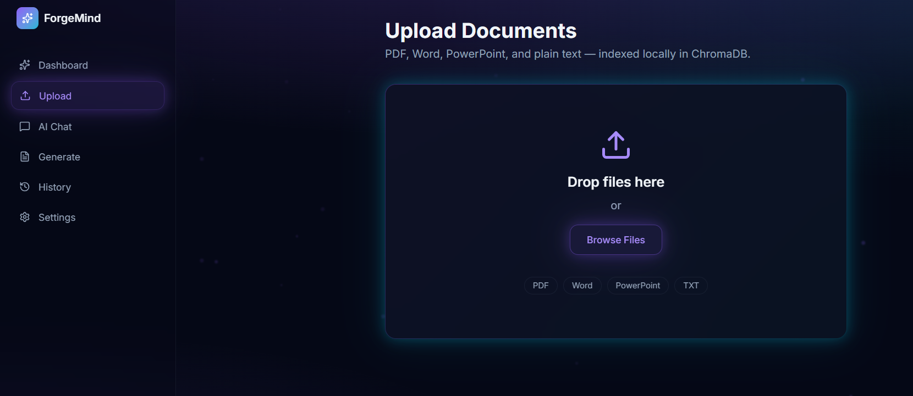
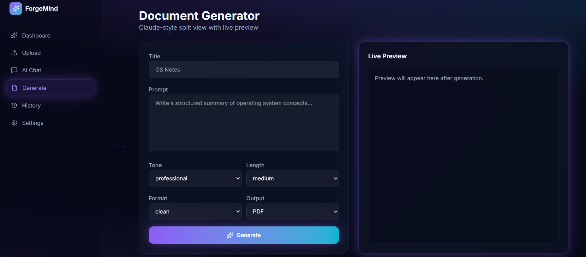
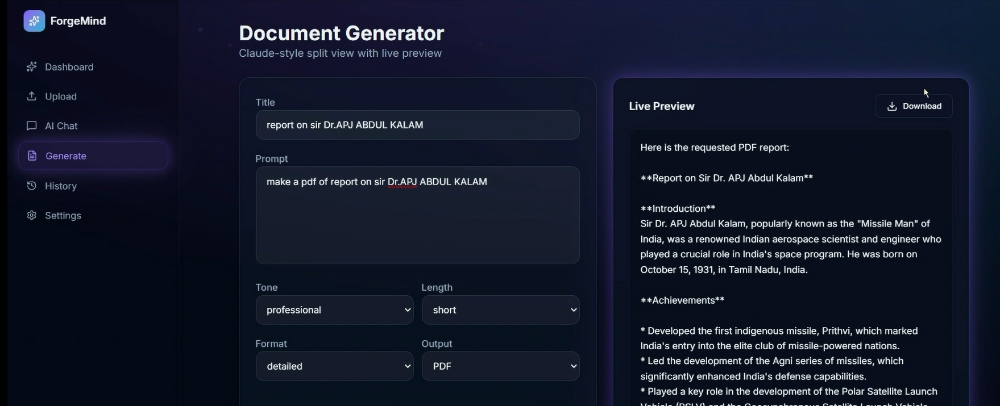
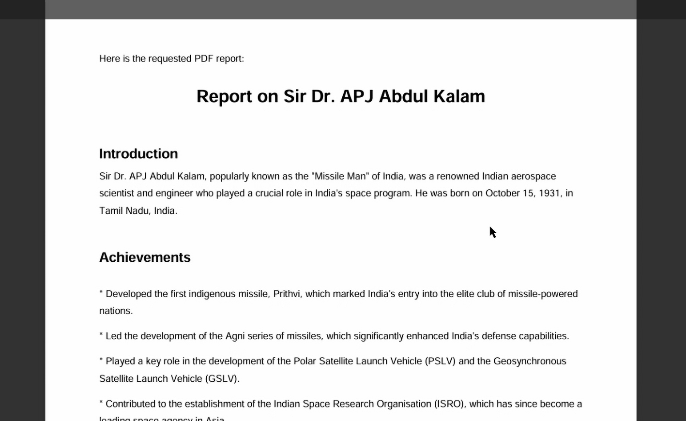

ForgeMind :AI-Powered Document Generation Platform

- Overview :

An AI-powered document generation platform that transforms natural language prompts into professionally formatted PDF and DOCX documents. The application leverages Large Language Models (LLMs) to generate high-quality content and provides an intuitive interface for document creation and management.

- Key Features :

AI-powered document generation from natural language prompts
Export generated content as PDF and DOCX
User authentication and secure login
Dashboard for document management
Fast and responsive user interface
Retrieval-augmented document generation using vector storage

- Technology Stack :

Frontend :

- React
- TypeScript
- CSS

Backend :

- FastAPI
- Python

Artificial Intelligence :

- Ollama
- Llama 3
- LLM Layer

Database & Storage :

- MySQL
- ChromaDB (Vector Database)

-- Project Architecture :

User Prompt
→ React Frontend
→ FastAPI Backend
→ Llama 3 (Ollama)
→ ChromaDB Retrieval
→ AI Response Generation
→ PDF/DOCX Export

- Screenshots :

Login Page :

UploadPage :

Generator :

Generated Document :

Generated doc pdf :

- Demo :

A complete demonstration video is available in the Demo folder.

- Future Enhancements :

Multi-language document generation
Cloud deployment
Real-time collaboration
Advanced document templates
AI-assisted editing and summarization

